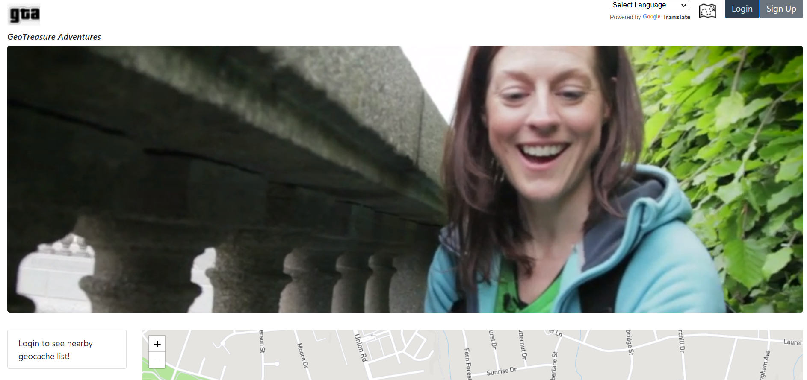

# GeoTreasure Adventures

# Project 2 Description

## User Story

```AS A modern-day adventurer in search of treasure
I WANT an application that will allow me to view available bounties and their geographic locations
SO THAT I can get some fresh air and go on a treasure hunt
GIVEN a map interface application that accepts user input
WHEN I am prompted for login information
THEN I can login with existing credentials or register
WHEN I am logged in
THEN I can view my profile, view a map of nearby geocaches, and create a new geocache
WHEN I am finished searching for hidden treasures
THEN I can log out of the application and end my session
WHEN I select a geocache to search for
THEN I am presented with information about it such as coordinates, title, size, and description
WHEN I find a geocache
THEN I can mark it in the app as "found" and add/update a "last found" date for the geocache
WHEN I am prompted to register or login
THEN I can enter a username, email, and password
WHEN I select navigate on a given geocache
THEN I am provided routing directions to it from my location
```

## Link to Site
https://geotreasureadventures.herokuapp.com/



## Technologies used:
- Framework: Bootstrap 
- Google Translate
- Open Street Map ​
- Use Handlebars.js as the template engine.
- Geocaching API
- Mapbox
- Leaflet JS
- Openlayers
- MapBox


## Project Requirements


- Use Node.js and Express.js to create a RESTful API.
  ​
- Use Handlebars.js as the template engine.
  ​
- Use MySQL and the Sequelize ORM for the database.
  ​
- Have both GET and POST routes for retrieving and adding new data.
  ​
- Use at least one new library, package, or technology that we haven’t discussed.
  ​
- Have a folder structure that meets the MVC paradigm.
  ​
- Include authentication (express-session and cookies).
  ​
- Protect API keys and sensitive information with environment variables.
  ​
- Be deployed using Heroku (with data).
  ​
- Have a polished UI.
  ​
- Be responsive.
  ​
- Be interactive (i.e., accept and respond to user input).
  ​
- Meet good-quality coding standards (file structure, naming conventions, follows best practices for class/id naming conventions, indentation, quality comments, etc.).
  ​
- Have a professional README (with unique name, description, technologies used, screenshot, and link to deployed application).

## GitHub Repository

You can view the link to our GitHub repository here:
https://github.com/joshuamaney/gta

## Link to Site
https://geotreasureadventures.herokuapp.com/
